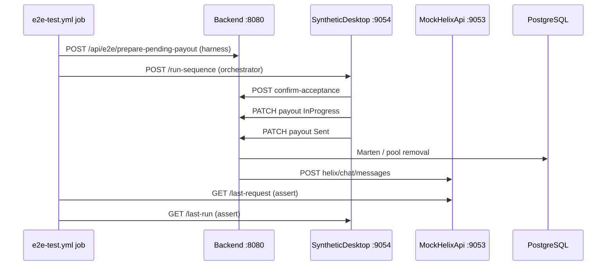

<!-- Updated: 2026-04-06 (Tier B closure + Tier C kick-off) -->

# Tier B — maintainer handover

**Parent:** [`E2E_AUTOMATION_PLAN.md`](E2E_AUTOMATION_PLAN.md) · **Issue tracking:** [GitHub issue #16](https://github.com/ai-warevo/MimironsGoldOMatic/issues/16) · **Structure map:** [`PROJECT_STRUCTURE.md`](../reference/PROJECT_STRUCTURE.md) · **Recurring tasks:** [`TIER_B_MAINTENANCE_CHECKLIST.md`](TIER_B_MAINTENANCE_CHECKLIST.md)

This package summarizes **CI Tier B** (Linux-hosted mocks, no real WoW) so new maintainers can operate, extend, and debug the pipeline without re-reading the full planning history.

---

## 1. Architecture overview

### Components

| Role | Project / path | Loopback port (CI) |
|------|----------------|--------------------|
| **EBS** (Development + E2E harness) | [`src/MimironsGoldOMatic.Backend/`](../../src/MimironsGoldOMatic.Backend/) | **8080** |
| **MockEventSubWebhook** | [`src/Mocks/MockEventSubWebhook/`](../../src/Mocks/MockEventSubWebhook/) | **9051** |
| **MockExtensionJwt** | [`src/Mocks/MockExtensionJwt/`](../../src/Mocks/MockExtensionJwt/) | **9052** |
| **MockHelixApi** | [`src/Mocks/MockHelixApi/`](../../src/Mocks/MockHelixApi/) | **9053** |
| **SyntheticDesktop** | [`src/Mocks/SyntheticDesktop/`](../../src/Mocks/SyntheticDesktop/) | **9054** |
| **PostgreSQL** | service container `postgres:16-alpine` | **5432** |

### Control flow (Tier B slice)

SyntheticDesktop performs the same REST sequence as [`MimironsGoldOMatic.Desktop`](../../src/MimironsGoldOMatic.Desktop/): **confirm-acceptance** → **PATCH** `InProgress` → **PATCH** `Sent`. On **`Sent`**, Backend calls **Helix Send Chat Message**; in CI, **`Twitch:HelixApiBaseUrl`** points at **MockHelixApi**, which records **`POST`** bodies for assertions.



### Component interaction (static)

```text
                    ┌─────────────────────┐
  MockEventSub ───► │      Backend        │ ◄─── SyntheticDesktop
   (9051)           │  (8080, Marten,     │       (9054)
                    │   HelixChatService) │
  MockExtensionJwt ─┤                     ├────► MockHelixApi (9053)
   (9052)           │                     │
                    └──────────┬──────────┘
                               │
                         PostgreSQL :5432
```

---

## 2. Local development setup

Mirror [`.github/workflows/e2e-test.yml`](../../.github/workflows/e2e-test.yml) on **Linux/macOS/WSL** or multiple terminals on **Windows**:

1. **PostgreSQL 16** with database **`mgm`**, user/password aligned with Backend `ConnectionStrings:PostgreSQL`.
2. **Scoped build:** Shared → Backend → all mock projects (`dotnet build` `-c Release`), same order as CI.
3. **Environment:** `ASPNETCORE_ENVIRONMENT=Development`, **`Mgm:EnableE2eHarness=true`**, **`Mgm:ApiKey`**, **`Twitch:HelixApiBaseUrl=http://127.0.0.1:9053`**, dummy **`Twitch:*`** token fields (see workflow `env`).
4. Start **Backend**, then **9051–9054** mocks; run [`.github/scripts/tier_b_verification/check_workflow_integration.py`](../../.github/scripts/tier_b_verification/check_workflow_integration.py).
5. **Tier B orchestrator:** [`.github/scripts/run_e2e_tier_b.py`](../../.github/scripts/run_e2e_tier_b.py) with **`--api-key`** matching **`Mgm:ApiKey`**.

Detailed walkthrough: [**Tier B First Run Guide** in `E2E_AUTOMATION_PLAN.md`](E2E_AUTOMATION_PLAN.md#tier-b-first-run-guide) and [**Setting up Tier B Environment** in the Backend README](../components/backend/ReadME.md).

---

## 3. Configuration guide

| Variable / setting | Where | Purpose |
|--------------------|-------|---------|
| **`Mgm:ApiKey`** | Backend + SyntheticDesktop | Authenticates Desktop/Synthetic routes (`X-MGM-ApiKey`). |
| **`Mgm:EnableE2eHarness`** | Backend (Development only) | Enables **`POST /api/e2e/prepare-pending-payout`**. |
| **`Twitch:HelixApiBaseUrl`** | Backend | **Empty** = production Helix root; CI uses **`http://127.0.0.1:9053`** (mock root, not `.../helix`). |
| **`Twitch:EventSubSecret`** | Backend + MockEventSub + `send_e2e_eventsub.py` | HMAC for synthetic EventSub. |
| **`SyntheticDesktop:BackendBaseUrl`** | SyntheticDesktop | EBS base URL (**`http://127.0.0.1:8080`** in CI). |
| **Ports** | All mock `ASPNETCORE_URLS` | Fixed **9051–9054**, **8080** — change only with coordinated doc updates. |

Source of truth for options: [`TwitchOptions.cs`](../../src/MimironsGoldOMatic.Backend/Configuration/TwitchOptions.cs), Backend [`appsettings.Development.json`](../../src/MimironsGoldOMatic.Backend/appsettings.Development.json) (if present), workflow `env` block.

---

## 4. Troubleshooting matrix

| Symptom | Likely cause | What to do |
|---------|--------------|------------|
| **`404`** on **`prepare-pending-payout`** | Harness off or not Development | Set **`Mgm__EnableE2eHarness`** + **`ASPNETCORE_ENVIRONMENT=Development`**. |
| **`400`** not in pool | Tier A enrollment missing / wrong user id | Run **`send_e2e_eventsub.py`** first; align **`twitchUserId`** with orchestrator. |
| Helix mock never receives POST | **Base URL** includes `/helix`, or tokens empty | Use mock **root** only; ensure Broadcaster token/UserId/ClientId non-empty so **`HelixChatService`** does not skip. |
| **Connection refused** on **905x** | Process not started or wrong order | Start Backend before SyntheticDesktop; verify **`GET /health`** on each mock. |
| **`check_workflow_integration`** timeout | Slow runner / Postgres | Increase wait loops in workflow only after confirming bind time in **`mgm-*.log`** artifacts. |
| Python **`requests`** error | pip deps missing locally | **`pip install -r .github/scripts/tier_b_verification/requirements.txt`**. |

Extended tables: [`E2E_AUTOMATION_PLAN.md` — Tier B Troubleshooting Guide](E2E_AUTOMATION_PLAN.md#tier-b-troubleshooting-guide).

---

## 5. Maintenance procedures

| Task | Guidance |
|------|----------|
| **Update mocks** | Change [`src/Mocks/`](../../src/Mocks/); keep **`GET /health`** and Tier B contract endpoints stable or version the orchestrator (`run_e2e_tier_b.py`). |
| **Change HTTP choreography** | Update **SyntheticDesktop** and [`run_e2e_tier_b.py`](../../.github/scripts/run_e2e_tier_b.py) together; align with [`DesktopPayoutsController`](../../src/MimironsGoldOMatic.Backend/Controllers/DesktopPayoutsController.cs). |
| **Add assertion** | Prefer extending Python orchestrator or Tier B verification scripts under [`.github/scripts/tier_b_verification/`](../../.github/scripts/tier_b_verification/). |
| **Rotate CI-only secrets** | Today inline `env` in workflow; if moving to GitHub **Secrets**, update **MockEventSub** + **`send_e2e_eventsub.py`** + Backend in one PR. |

Full checklist: [`TIER_B_MAINTENANCE_CHECKLIST.md`](TIER_B_MAINTENANCE_CHECKLIST.md). Pipeline deep-dive: [`E2E_AUTOMATION_PLAN.md` — E2E Pipeline Maintenance Guide](E2E_AUTOMATION_PLAN.md#e2e-pipeline-maintenance-guide).

---

## 6. Subject-matter experts (update in-repo)

Replace placeholders with real names/handles as the team stabilizes:

| Area | Expert (placeholder) |
|------|----------------------|
| **Backend / Marten / Helix integration** | *Assign: Backend owner* |
| **GitHub Actions / mocks / Python harness** | *Assign: CI owner* |
| **WPF Desktop (parity with SyntheticDesktop)** | *Assign: Desktop owner* |
| **WoW addon / `[MGM_*]` tags** | *Assign: Addon owner* |
| **Twitch Extension / Helix product behavior** | *Assign: Extension owner* |

---

*Tier B CI does not replace manual **WinAPI + WoW** validation; see [`TIER_C_REQUIREMENTS.md`](TIER_C_REQUIREMENTS.md).*
